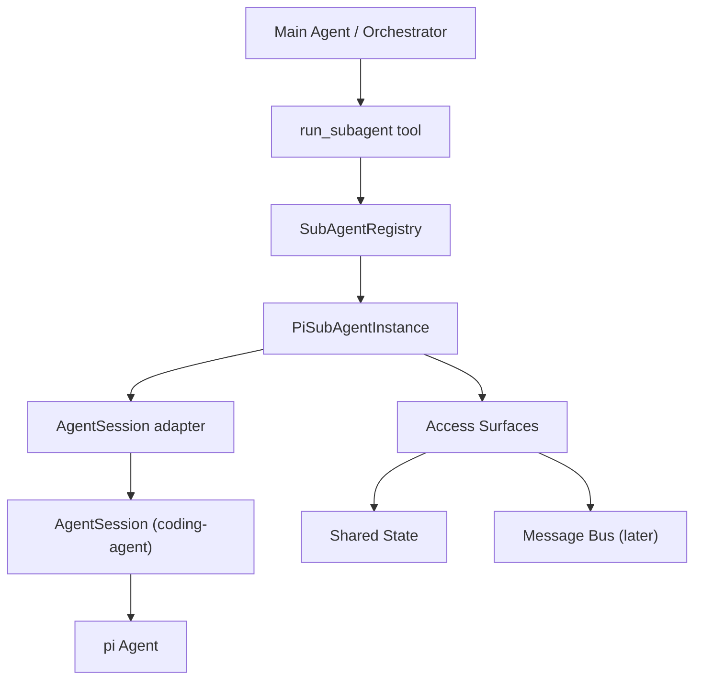
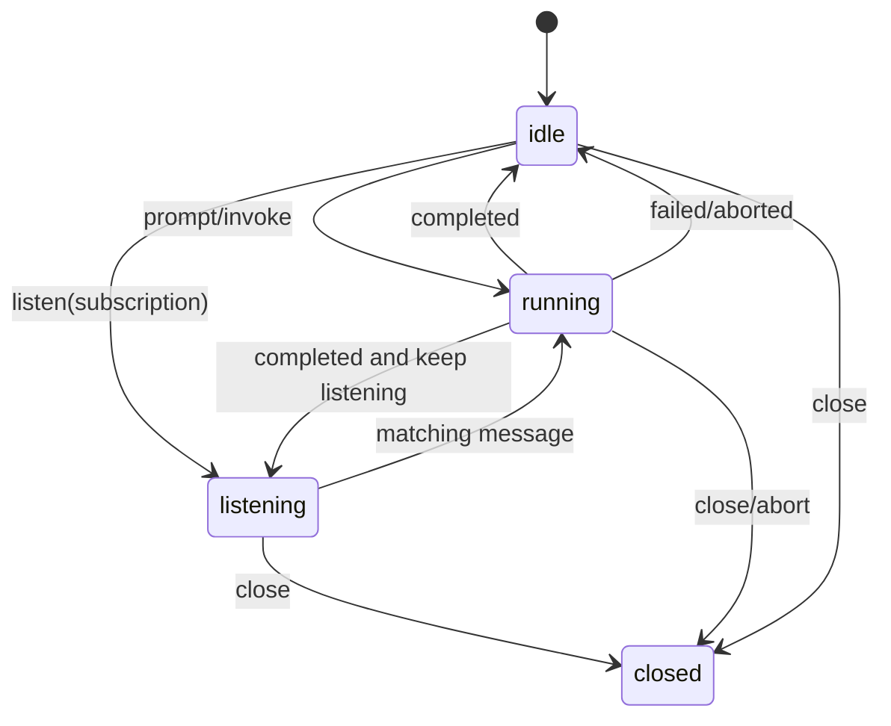
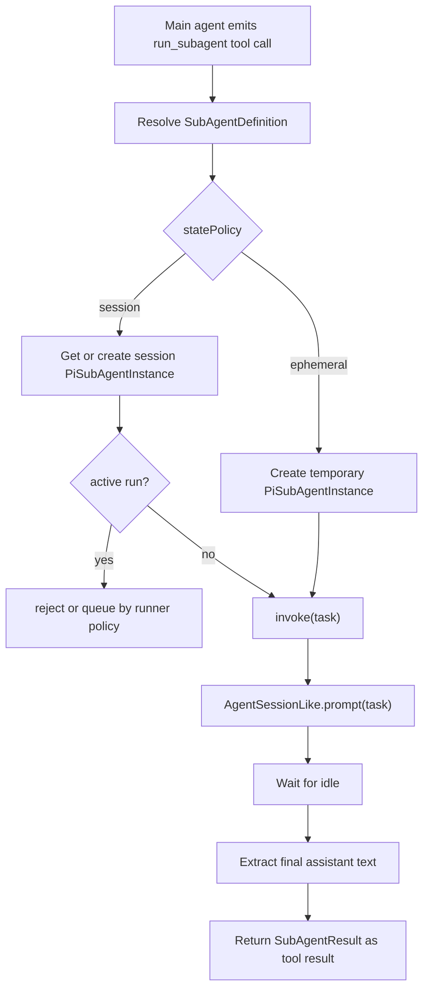

# Pi Multi-Agent SubAgent 设计方案

## 1. 背景与目标

本设计的目标不是为某一个 PM 协作场景定制 multi-agent，而是在当前 pi / coding-agent 架构上增加一层通用的 SubAgent 能力，使它能够支撑多种 multi-agent 协作模式：

- Orchestrator–Workers
- Shared State
- Message Bus
- Agent Team

第一期不做完整的 multi-agent orchestration runtime，而是先把 **SubAgent 层** 做扎实。

核心目标：

```text
PiSubAgent = 当前 pi AgentSession 语义的兼容超集
```

也就是说：

- 不配置额外 multi-agent 能力时，PiSubAgent 行为应尽量等价于普通 pi agent。
- 配置 access surface 后，SubAgent 可以访问 shared memory、bus 等 multi-agent 协作面。
- 每个 SubAgent 独立定义 system prompt、tools、skills、MCP、权限，不从主 agent 继承。
- 上层 orchestration 只负责什么时候调用谁、并发多少、何时停止，不负责 SubAgent 内部如何装配 prompt/tools/session。

---

## 2. 当前 pi agent 机制简述

当前 pi 里没有 first-class sub-agent。现有运行结构是：

```text
Agent = 单个 agentic loop
AgentSession = 带 session / tools / skills / extensions 的产品级 agent wrapper
SessionManager = session 持久化与恢复
```

典型流程：

1. `createAgentSession()` 创建 `Agent`、`SessionManager`、`AgentSession`。
2. 用户、RPC 或 CLI 调用 `AgentSession.prompt()` / `steer()` / `followUp()`。
3. `AgentSession` 内部调用 `Agent.prompt()` / `Agent.continue()`。
4. `Agent` 进入 agentic loop：LLM -> tool call -> tool result -> LLM。
5. `AgentSession` 监听 `Agent` 事件，把消息 append 到 `SessionManager`。
6. resume 时，通过 `SessionManager.buildSessionContext()` 还原 `agent.state.messages`。

因此，PiSubAgent 第一版应复用 `AgentSession` 的语义，而不是重新实现一套 session 机制。为了避免包依赖成环，`packages/multi-agent` 不直接 import `AgentSession`，而是依赖一个 `AgentSessionLike` 接口和由 `packages/coding-agent` 提供的 factory/adapter。

---

## 3. 总体架构

新建包：

```text
packages/multi-agent
```

第一版不直接依赖 `packages/coding-agent` 的 concrete `AgentSession`。`packages/multi-agent` 只定义 `AgentSessionLike` 和 factory 接口；`packages/coding-agent` 负责提供 adapter，把现有 `AgentSession` 注入进来。

这样既能复用当前 pi 的 session 行为，又能避免 `coding-agent -> multi-agent -> coding-agent` 的包依赖成环。



第一期核心组件：

```text
packages/multi-agent
  - PiSubAgentDefinition
  - PiSubAgentInstance
  - AgentSessionLike
  - AgentSessionFactory
  - SubAgentRegistry
  - SubAgentStatePolicy
  - SharedStateAccessSurfaceDefinition
  - SharedStateManifest
  - MemorySharedStateManifest
  - run_subagent tool factory / executor
```

Bus 先明确接口和生命周期，具体实现可以后置。

### 3.1 当前实现状态：Phase 3 已完成

截至 Phase 3，已完成的范围是：

```text
packages/multi-agent
  PiSubAgentInstance / SubAgentRegistry / AgentSessionLike / AgentSessionFactory
  SharedStateArtifact / SharedStateManifest / MemorySharedStateManifest / SharedStateGrant

packages/coding-agent/src/core/multi-agent
  AgentSession adapter
  CodingAgentSessionFactory
  restricted resource loader
  direct run_subagent tool（Phase 2-1 临时主流程验证入口）
  shared_state.* tools
```

已验证：

- `PiSubAgentInstance` 可以包装真实 `coding-agent AgentSession`。
- `packages/multi-agent` 没有反向依赖 `packages/coding-agent`。
- sub-agent 默认使用 restricted resource loader，不自动继承主 session 的 tools / skills / extensions / context files。
- sub-agent 内部 transcript 不进入主 session。
- CLI / TUI 主流程可通过 `PI_MULTI_AGENT_DIRECT_SUBAGENT=1` 注册 direct `run_subagent` 并成功调用 sub-agent。
- 不要求调用 `run_subagent` 时，主 agent 仍按普通 agentic loop 直接回答。
- Shared State 已实现 file-backed workspace + in-memory manifest，提供 `shared_state.list/read/grep/write/edit`。
- Shared State 已验证 space 授权、owner 写保护、version 乐观锁、path escape 防护和真实文件读写。

验证命令：

```bash
cd packages/coding-agent
node ../../node_modules/vitest/dist/cli.js --run test/multi-agent-adapter.test.ts test/multi-agent-direct-tool.test.ts

npm --prefix packages/multi-agent run test
cd packages/coding-agent
node ../../node_modules/vitest/dist/cli.js --run test/multi-agent-shared-state-tools.test.ts
cd ../..
node --import ./node_modules/tsx/dist/loader.mjs packages/coding-agent/examples/multi-agent/shared-state-smoke.ts
npm run check
```

真实 provider smoke：

```bash
cd packages/coding-agent
PI_MULTI_AGENT_DEEPSEEK_SMOKE=1 DEEPSEEK_API_KEY=<real-key> \
  node ../../node_modules/vitest/dist/cli.js --run test/multi-agent-deepseek-smoke.test.ts
```

Phase 2-1 的 `run_subagent` 只是主流程接入验证入口，不是最终 orchestration policy。它不负责自动判断任务是否应派发给 sub-agent；如果需要默认 worker 模式，应在后续 orchestration policy 层实现。

---

## 4. 兼容性设计决策

本节不是列出“不兼容风险”，而是把这些问题前置转化为设计约束。目标是：在不改动现有 pi agent loop 的前提下，让 multi-agent 能自然嵌入 pi-mono。

### 4.1 包边界：multi-agent 只依赖接口，不反向依赖 coding-agent

`packages/multi-agent` 不能直接 import `packages/coding-agent` 的 concrete `AgentSession`。否则当 `coding-agent` 内置 `run_subagent` tool 并 import `multi-agent` 时，会形成依赖环。

因此设计为：

```text
packages/multi-agent
  定义 AgentSessionLike
  定义 AgentSessionFactory
  定义 PiSubAgentInstance / Registry / Shared State access surface

packages/coding-agent
  提供 AgentSession adapter
  提供 AgentSessionFactory 实现
  注册 run_subagent tool
  把现有 createAgentSession 能力注入给 multi-agent
```

这样 `multi-agent` 依赖的是结构化接口，`coding-agent` 负责把现有产品层能力适配进去。

### 4.2 Session 创建：通过 AgentSessionFactory 创建受限 session

SubAgent 不直接克隆主 agent runtime，也不默认继承主 agent 配置。

`AgentSessionFactory` 的职责是根据 `PiSubAgentDefinition` 创建一个受限的 `AgentSessionLike`：

```ts
interface AgentSessionFactory {
  create(input: CreateSubAgentSessionInput): Promise<AgentSessionLike>;
}

interface CreateSubAgentSessionInput {
  parentSessionId: string;
  subAgentId: string;
  invocationId?: string;
  statePolicy: "ephemeral" | "session" | "persistent";
  initialState: SubAgentInitialState;
  tools: SubAgentToolSpec[];
  skills: SubAgentSkillSpec[];
  mcpServers: SubAgentMcpServerSpec[];
  accessSurfaceTools: AgentTool[];
  session: SubAgentSessionOptions;
  permissions: SubAgentPermissionPolicy;
}
```

兼容策略：

```text
复用 AgentSession 的 prompt / steer / followUp / session persistence 语义
但 tools / skills / MCP / access surfaces 全部来自 SubAgentDefinition
不从主 agent 隐式继承高权限能力
```

#### SubAgent 资源装配策略

`AgentSessionFactory` 复用现有 session/runtime 基础设施，但不能直接复用普通 CLI session 的默认资源发现路径。否则 sub-agent 会自动加载项目级 `CLAUDE.md` / `AGENTS.md`、skills、extensions 等资源，形成隐式继承。

Phase 1 约束：

```text
普通主 agent：
  可以使用默认 ResourceLoader 自动发现项目资源

SubAgent：
  必须使用受限 ResourceLoader 或等价策略
  默认不自动发现 context files / skills / prompt templates / themes / extensions
  只加载 SubAgentDefinition 显式声明或 AgentSessionFactory 显式注入的资源
```

这意味着：

- SubAgent 可以拥有 skills 和 MCP，但必须来自 `SubAgentDefinition` 的显式声明与 factory 注入。
- SubAgent 不会自动继承主 agent 已加载的 skills、MCP、extensions、项目级 context files。
- 如果第一批尚未实现某类显式资源注入，session 创建应返回明确错误，而不是静默继承或静默忽略。
- `AgentSessionFactory.create()` 是 Phase 1/2 中 definition 资源支持性的最终校验点；若 definition 声明了当前阶段不支持的 skills / MCP 注入方式，应在这里返回结构化错误并阻止 session 创建。
- Phase 1/2 中，SubAgent 的 system prompt 仅由 `PiSubAgentDefinition.initialState.systemPrompt` 与 factory 显式注入的 append prompt 构成；不会自动拼入项目级 context files。

### 4.3 能力装配：SubAgent 显式声明全部能力

SubAgent 的能力集合由 definition 决定：

```text
tools
skills
mcpServers
accessSurfaces
permissions
```

主 agent 的工具、技能、MCP 不会自动传递给 SubAgent。

这样可以保证：

```text
plan-agent 不会意外拿到 edit/write/bash
review-agent 不会意外拿到外部发布权限
data-agent 只看到自己需要的数据访问面
```

AccessSurface 生成的工具也通过同一条装配路径进入 `AgentSessionLike`，但在 metadata / trace 中保留来源：

```text
source = "accessSurface"
accessSurfaceType = "sharedMemory" | "bus" | "teamState"
```

### 4.4 事件隔离：SubAgent 内部事件默认不进入主 agent transcript

SubAgent 内部会产生 message / tool / retry / compaction / error 等事件。为了不污染主 agent 的 UI、RPC 输出和 transcript，默认设计为：

```text
SubAgent 内部事件 -> SubAgent 自己的 session / trace
run_subagent tool result -> 主 agent transcript
```

也就是说，主 agent 默认只看到 `SubAgentResult`。

调试时可以显式开启：

```text
includeEvents
includeMessages
includeToolTrace
includeSessionFile
```

但这些是 `run_subagent` 的调试选项，不是默认行为。

### 4.5 Session 隔离：每个 SubAgent 拥有自己的 session 空间

SubAgent 不写入主 agent session。每个 SubAgent session 独立保存，便于 resume、debug 和权限隔离。

建议 session 识别维度：

```text
parentSessionId
subAgentId
statePolicy
invocationId
```

但 `packages/multi-agent` 不应过早把磁盘路径结构固化成协议。session 文件落盘位置、命名方式和是否持久化，应由 `packages/coding-agent` 内的 `AgentSessionFactory` / `SessionManager` 策略决定。

策略：

```text
ephemeral: 每次 invocation 独立 session，可配置是否保留文件
session: 每个 subAgentId 复用 session，默认保留文件
persistent: 第一阶段仅保留类型语义；若传入，应明确 reject 或降级，而不是假装提供长期实体能力
```

### 4.6 并发控制：复用 tool parallel，但增加 SubAgent runner 约束

Orchestrator–Workers 可以复用现有 pi 的 parallel tool execution：主 agent 同一轮发多个 `run_subagent` tool call，即可并发运行多个 SubAgent。

但 multi-agent 层需要增加一个轻量 runner 约束：

```text
同一个 session/persistent SubAgentInstance 同时只允许一个 active run
不同 ephemeral SubAgentInstance 可以并发
可配置 maxConcurrentSubAgents
run_subagent 接收 timeout / abort signal
后续再接 token / cost budget
```

这样不需要修改 pi agent loop，也能避免同一个 SubAgent session 被多个任务同时写入。

### 4.7 Shared State：作为 AccessSurface 实现，不改 agent loop

Shared State 不进入 `Agent` 或 `AgentSession` 内核。它作为 `AccessSurface` 被 mount 成工具：

```text
shared_state.list
shared_state.read
shared_state.grep
shared_state.write
shared_state.edit
```

兼容策略：

```text
pi-agent 仍然只看到普通 tool call
multi-agent 层记录这些 tool 来自 Shared State access surface
write/edit 自动记录 ownerAgentId/createdBy/updatedBy/version
```

File backend 下：

```text
写入必须走 shared_state.write/edit，保留 provenance/version
只读 agent 可通过 scoped read/grep 查看 shared state root
shared state root 独立于项目代码 root
默认 root 约定为 .pi/multi-agent/shared-state/<runId>/
```

这样既符合 pi 的 tool 调用模型，又保留 multi-agent 协作面的语义。

### 4.8 Bus：不改变 prompt 语义，新增 listen 入口

`prompt()` 在 PiSubAgent 中仍然表示“立即触发一次 agentic loop”。为了兼容当前 pi 行为，Bus 不复用 `prompt()` 表示监听。

Bus 使用独立入口：

```text
listen(subscription)
```

Bus 状态机：

```text
idle -> listening -> running -> listening
```

消息投递规则：

```text
SubAgent listening 时才能消费消息
SubAgent running 时不消费新消息，消息继续积压
消息匹配后，Bus 内部把 message 转成 prompt/followUp，触发一次 agentic loop
```

第一期只保留接口和状态语义，不实现完整 bus runtime。

### 4.9 第一阶段落地边界

为了保证接入成本可控，第一期实现边界固定为：

```text
不修改 pi Agent / agent-loop
不让 multi-agent 直接依赖 concrete AgentSession
不让 SubAgent 默认继承主 agent 能力
不把 SubAgent 内部事件默认暴露到主 agent transcript
不实现完整 bus / agent-team runtime
```

第一期重点实现：

```text
AgentSessionLike adapter
AgentSessionFactory
PiSubAgentInstance
SubAgentRegistry
SharedStateAccessSurfaceDefinition
run_subagent tool factory / executor
session/event isolation
```

---

## 5. PiSubAgent 的核心定义

### 5.1 Definition 与 Instance

`PiSubAgentDefinition` 是静态定义，描述这个 SubAgent 是谁、能做什么、拥有哪些能力。

`PiSubAgentInstance` 是运行时实体，内部持有 `AgentSessionLike`。在 coding-agent 接入时，这个 `AgentSessionLike` 由现有 `AgentSession` 适配而来。

```text
PiSubAgentDefinition
  ├─ id / name / description
  ├─ initialState.systemPrompt
  ├─ initialState.model
  ├─ initialState.thinkingLevel
  ├─ tools
  ├─ skills
  ├─ mcpServers
  ├─ accessSurfaces
  ├─ statePolicy
  └─ permissions / sandbox policy

PiSubAgentInstance
  ├─ definition
  ├─ session: AgentSessionLike
  ├─ phase
  └─ lifecycle methods
```

### 5.2 AgentSessionLike 接口

`packages/multi-agent` 不直接依赖 concrete `AgentSession`，而是定义最小结构化接口。coding-agent 的 `AgentSession` 通过 adapter 满足这个接口。

```ts
interface AgentSessionLike {
  readonly state: AgentState;
  readonly sessionId: string;
  readonly sessionFile?: string;
  readonly model: Model<any> | undefined;
  readonly thinkingLevel: ThinkingLevel;

  prompt(input: string | AgentMessage | AgentMessage[], options?: unknown): Promise<void>;
  steer(message: string | AgentMessage, images?: ImageContent[]): Promise<void>;
  followUp(message: string | AgentMessage, images?: ImageContent[]): Promise<void>;
  abort(): Promise<void>;
  waitForIdle(): Promise<void>;
  subscribe(listener: (event: unknown) => Promise<void> | void): () => void;
  dispose(): Promise<void> | void;
}
```

PiSubAgent 应尽量保留当前 AgentSession / Agent 的接口风格：

```text
state        -> session.state
sessionId    -> session.sessionId
sessionFile  -> session.sessionFile
model        -> session.model
thinkingLevel -> session.thinkingLevel

prompt()     -> session.prompt()
steer()      -> session.steer()
followUp()   -> session.followUp()
abort()      -> session.abort()
waitForIdle()-> session.waitForIdle()
subscribe()  -> session.subscribe()
```

新增 SubAgent 语义：

```text
invoke(task)   // 直接任务调用，内部转成 prompt
listen(spec)   // bus 模式下进入监听状态
inspect()      // 返回 phase/session/status
close()        // 关闭运行时实例，不默认删除 session
```

其中 `close()` 应通过 `AgentSessionLike.dispose()` 或等价机制释放底层 session/runtime 资源；它不等于删除 session 文件。

语义边界：

- `abort()`：只停止当前 active run，实例仍可继续复用。
- `close()`：关闭 SubAgentInstance，使其后续不可再次 `invoke()`。
- `dispose()`：底层 session/runtime 资源释放动作，由 `close()` 调用；不等于删除 session 文件。

### 5.3 兼容性原则

必须满足：

```text
当 accessSurfaces = [] 且 statePolicy = session 时，
PiSubAgent 的行为应尽量等价于普通 AgentSession adapter。
```

这包括：

- session 持久化语义一致
- model / thinking level 恢复语义一致
- message append 语义一致
- prompt / steer / followUp / abort 行为一致
- tools / skills / MCP / access surfaces 只来自 SubAgentDefinition
- resource loader / retry / compaction / extension hook 通过 AgentSessionFactory 按需启用，不默认复制主 agent runtime

---

## 6. SubAgent 不负责 orchestration 策略

SubAgent 只负责完成具体任务，不决定整体协作策略。

SubAgent 负责：

```text
我是谁
我有什么 system prompt
我能使用哪些 tools / skills / MCP
我可以访问哪些 access surface
我是否保留 session/state
我如何被 prompt / invoke / listen
```

上层 orchestration 负责：

```text
什么时候调用谁
并发几个 worker
结果如何合并
什么时候停止
冲突由谁裁决
```

第一期不会实现完整 `CoordinationPolicy`，但会通过 `run_subagent` tool 支撑 Orchestrator–Workers。

---

## 7. 启动方式

### 7.1 Direct / Shared State SubAgent

普通 sub-agent 和 shared-memory sub-agent 都是 prompt 后立即进入 agentic loop。

```mermaid
sequenceDiagram
    participant Main as Main Agent
    participant Tool as run_subagent tool
    participant Sub as PiSubAgent
    participant Session as AgentSessionLike
    participant Loop as pi Agent Loop
    participant Memory as Shared State

    Main->>Tool: run_subagent(agentId, task)
    Tool->>Sub: invoke(task)
    Sub->>Session: prompt(task)
    Session->>Loop: Agent.prompt()
    Loop->>Memory: read/write via access tools
    Memory-->>Loop: tool result
    Loop-->>Session: final assistant message
    Session-->>Sub: completed
    Sub-->>Tool: SubAgentResult
    Tool-->>Main: tool result
```

这里 shared memory 不改变 agentic loop，只是给 SubAgent 多挂了一组协作访问工具。

### 7.2 Bus SubAgent

Bus 模式的启动语义不同。

Bus SubAgent 被启动后不应立即进入 agentic loop，而是进入监听状态。只有收到匹配消息后，才触发 loop。

```mermaid
sequenceDiagram
    participant Main as Main Agent
    participant Bus as Message Bus
    participant Sub as Bus SubAgent
    participant Session as AgentSessionLike
    participant Loop as pi Agent Loop

    Main->>Sub: listen(subscription)
    Sub->>Bus: subscribe(subscription)
    Sub-->>Main: listener handle
    Bus-->>Sub: matching message
    Sub->>Session: prompt(message as task)
    Session->>Loop: Agent.prompt()
    Loop-->>Session: final assistant message
    Session-->>Sub: completed
    Sub->>Bus: publish follow-up / ack
    Sub-->>Bus: return to listening
```

状态模型：



关键原则：

- `prompt()` 仍然表示立即触发一次 agentic loop，保持 pi 兼容语义。
- Bus 使用 `listen()`，不要改变 `prompt()` 的含义。
- Bus 收到消息后，内部再调用 `prompt()` 或等价机制触发 loop。
- 如果 SubAgent 正在 running，则不消费新消息，消息留在队列里。

---

## 8. State Policy

第一版定义三种 state policy。

### 8.1 ephemeral

```text
每次 invoke 通过 AgentSessionFactory 创建新的 AgentSessionLike；未来 bus listen-once 也使用同一策略
任务完成后 close 运行时实例
默认不保留长期实例
可选保留 trace/session file
```

适合：

- 一次性 worker
- 短任务 reviewer
- 无需长期上下文的专家 agent

### 8.2 session

```text
每个 subAgentId 维护自己的 AgentSessionLike
多次 invoke 复用同一个 session/messages
不运行时没有 active task
下一次 invoke 从同一 session 继续
```

适合：

- 需要跨多轮保留上下文的 worker
- shared memory worker
- 可重复触发的 bus subscriber

### 8.3 persistent

```text
session + 明确生命周期实体
可长期 listening/running
支持 inspect / close / assign
close 不删除 session，除非显式配置
```

适合：

- Agent Team 成员
- 长期 bus listener
- 需要持续状态和可观测生命周期的 sub-agent

第一期实现：

```text
ephemeral
session
```

`persistent` 在第一阶段只保留类型与后续演进方向，不作为可靠能力交付。
如果第一阶段传入 `persistent`，实现必须明确：

```text
要么 reject
要么按文档定义降级到 session
```

不能让定义存在看起来像已经支持长期实体生命周期。

---

## 9. Access Surface

### 9.1 定义

Access Surface 是 SubAgent 可接触 multi-agent 协作环境的方式。

它不是普通业务 tool，也不从主 agent 继承。它属于 multi-agent runtime 自己提供的协作能力层。

```text
Tool = agent 完成业务任务的能力，如 read repo、run test、edit file
AccessSurface = agent 访问协作面的能力，如 shared memory、bus、team state
```

在 pi runtime 下，AccessSurface 最终可能会被 adapter 挂载成 LLM tools，但这只是暴露方式，不改变概念归属。

### 9.2 权限原则

SubAgent 的 tools / skills / MCP / access surfaces 必须独立配置。

不允许默认继承主 agent 的能力。

原因：主 agent 通常权限更高，如果 plan agent 继承 edit/bash/write 之类能力，容易造成越权。

推荐配置模型：

```ts
accessSurfaces: [
  {
    type: "sharedMemory",
    namespace: "prd-workspace",
    permissions: ["read", "write", "append"]
  },
  {
    type: "bus",
    topics: ["prd.review"],
    permissions: ["subscribe", "publish"]
  }
]
```

最佳实践：

- 默认不给写权限。
- 每个 SubAgent 显式声明 read/write/append/publish/subscribe。
- access surface 生成的工具名称应带明确前缀，如 `shared_state.read`。
- Run trace 中应区分普通 tool call 与 access surface call。
- access surface 写入必须记录 agentId / taskId / sessionId 等 provenance。

---

## 10. Shared State 设计

Shared State 是第一期的主要 access surface。

它不定义 PRD、decision log、risk report 等业务语义，只提供通用共享状态工作区能力。上层应用通过 prompt、tools 和约定决定如何组织内容。

Phase 3 已从早期内存 KV 型 SharedMemory 收敛为 file-backed Shared State：

- 正文内容使用文件承载，便于复用 read / grep / edit / write 语义。
- 治理信息使用内存 manifest 承载，记录 owner、provenance、version。
- artifact identity 使用 normalized relative path，不额外引入业务类型枚举。
- path 第一段是 `space`，例如 `prd/demo.md`、`analysis/findings.md`。

### 10.1 数据结构

```ts
type SharedStatePermission = "list" | "read" | "grep" | "write" | "edit";

interface SharedStateArtifact {
  path: string;
  space: string;
  ownerAgentId: string;
  createdBy: string;
  updatedBy: string;
  version: number;
  createdAt: string;
  updatedAt: string;
  metadata?: Record<string, unknown>;
}

interface SharedStateGrant {
  space: string;
  permissions: SharedStatePermission[];
  canOverwrite?: boolean;
  canEditOthers?: boolean;
}
```

字段说明：

- `path`：artifact 的相对路径，也是 artifact id。
- `space`：path 第一段，用于隔离不同方面的共享内容。
- `ownerAgentId`：artifact 默认只能由 owner 覆盖或编辑。
- `createdBy/updatedBy`：记录 provenance。
- `version`：用于基础乐观锁。
- `metadata`：上层自由扩展。

### 10.2 Manifest 接口

最小接口：

```ts
interface SharedStateManifest {
  get(path: string): SharedStateArtifact | undefined;
  create(input: SharedStateCreateInput): SharedStateArtifact;
  update(input: SharedStateUpdateInput): SharedStateArtifact;
  list(space?: string): SharedStateArtifact[];
}
```

第一版实现：

```text
MemorySharedStateManifest
```

manifest 第一版不落盘。文件内容会保留在 shared state root，但进程重启后不会自动恢复 manifest。

### 10.3 Backend

第一版只实现 file-backed workspace。

```text
正文：shared state root 下的文件
治理：MemorySharedStateManifest
默认 root：.pi/multi-agent/shared-state/<runId>/
```

Phase 3 API 允许显式传入 root；测试和 smoke 使用 temp/root 路径。默认 root 在后续 orchestration 接入时启用。

### 10.4 暴露给 SubAgent 的工具

根据权限生成工具：

```text
shared_state.list
shared_state.read
shared_state.grep
shared_state.write
shared_state.edit
```

工具行为：

- `list/read/grep` 需要对应权限。
- `write` 创建新文件需要 `write` 权限。
- `write` 覆盖已有文件需要 `edit` 权限，并且当前 agent 是 owner，除非 grant 显式 `canOverwrite: true`。
- `edit` 需要 `edit` 权限，并且当前 agent 是 owner，除非 grant 显式 `canEditOthers: true`。
- `expectedVersion` 可选；传入时必须匹配 manifest 当前 version。

### 10.5 Path 与安全边界

- tool input 的 `path` 必须是相对路径。
- path 不能包含 escape：`..`、绝对路径、home path、Windows drive path。
- path 第一段必须是授权 `space`。
- 所有文件操作限制在 shared state root 内。
- 不直接暴露原始 repo `read/write/edit/grep/ls` 工具。

### 10.6 当前实现状态与验证

已实现文件：

```text
packages/multi-agent/src/shared-state/types.ts
packages/multi-agent/src/shared-state/memory-manifest.ts
packages/multi-agent/src/shared-state/index.ts
packages/coding-agent/src/core/multi-agent/shared-state-tools.ts
packages/coding-agent/examples/multi-agent/shared-state-smoke.ts
```

已验证：

- manifest create/update/list/expectedVersion。
- `shared_state.write/read/grep/edit/list` 的工具行为。
- 授权 space 访问和未授权 space 拒绝。
- owner 写保护和显式跨 owner 授权。
- expectedVersion mismatch 拒绝且无副作用。
- path escape 拒绝。
- 真实 smoke assert 工具输出、磁盘内容和 manifest 元数据。

验证命令：

```bash
npm --prefix packages/multi-agent run test
cd packages/coding-agent
node ../../node_modules/vitest/dist/cli.js --run test/multi-agent-shared-state-tools.test.ts
cd ../..
node --import ./node_modules/tsx/dist/loader.mjs packages/coding-agent/examples/multi-agent/shared-state-smoke.ts
npm run check
```

当前边界：

- Phase 3 不接入 direct `run_subagent`。
- Phase 3 不做 file manifest persistence。
- Phase 3 不做 lock、merge、semantic search、bus、agent-team。
- Shared State mount 到 sub-agent session 放到下一阶段。

---

## 11. Bus 设计草案

Bus 不作为第一期完整实现，但需要提前确定 SubAgent 语义。

### 11.1 事件结构

```ts
interface BusMessage {
  id: string;
  topic: string;
  type: string;
  key?: string;
  payload: unknown;
  targetAgentId?: string;
  tags?: string[];

  parentMessageId?: string;
  correlationId?: string;
  causationId?: string;

  createdAt: string;
}
```

### 11.2 Subscription

参考 MQ / Kafka 的 topic + consumer 语义，但保留 agent 场景需要的规则匹配。

```ts
interface Subscription {
  topics?: string[];
  types?: string[];
  targetAgentId?: string;
  tags?: string[];
  filter?: JsonPredicate;
  llmMatch?: boolean;
}
```

路由顺序：

```text
1. targetAgentId 精确匹配
2. topic / type / tags / filter 规则匹配
3. 可选 LLM match
```

第一版应以规则匹配为主，LLM 匹配为辅。

### 11.3 投递与并发

建议语义：

```text
at-least-once + ack
```

流程：

```text
message queued
-> matching listener idle
-> deliver
-> agent running
-> success ack / failure retry
-> exceed retry -> dead letter
```

如果 agent 正在 running：

```text
不消费新消息，消息继续积压在队列中
```

第一版每个 bus sub-agent 单并发即可。

### 11.4 Bus 与 SubAgent 的关系

Bus agent 的 `listen()` 不是立即跑 LLM，而是注册订阅。

消息到达后，Bus 触发 SubAgent 内部一次 agentic loop。完成后：

- `ephemeral`：关闭。
- `session`：回到 listening，但不一定常驻实体。
- `persistent`：保持长期 listening lifecycle。

---

## 12. SubAgent 调用结果

Direct sub-agent 默认返回给主 agent。

第一期简化结果格式：

```ts
interface SubAgentResult {
  status: "completed" | "failed" | "aborted";
  agentId: string;
  invocationId: string;
  sessionId: string;
  sessionFile?: string;
  finalText?: string;
  errorMessage?: string;
}
```

默认只返回 final assistant text，不返回完整 transcript。

`finalText` 提取规则：

```text
取本次 invocation 完成后新增的最后一条 assistant message 中的文本内容
若最终状态为 failed / aborted，则 finalText 为空，错误通过 status + errorMessage 表达
若 completed 但没有 assistant 文本输出，则 finalText 为空字符串
```

可选调试参数后续再加：

```text
includeMessages
includeToolTrace
includeSessionFile
```

Bus agent 不需要同步调用结果。它消费消息后：

```text
publish 新消息
写 shared memory
ack / fail
```

`listen()` 只返回 listener handle 或当前 status。

---

## 13. Agent 之间的交互边界

第一期定死：

```text
SubAgent 之间不能直接 invoke 彼此。
```

允许：

- 主 agent 调用 sub-agent。
- sub-agent 返回结果给主 agent。
- sub-agent 读写 shared memory，间接影响其他 sub-agent 的上下文。
- 后续 bus 模式下，sub-agent 可以 publish message，但是否触发其他 agent 由 bus/router 决定。

不允许：

- sibling agent 直接创建 / close / invoke 其他 sibling agent。
- sub-agent 隐式继承主 agent 工具权限。

---

## 14. Tools / Skills / MCP 装配

每个 SubAgent 独立声明自己的能力集合。

```text
sub-agent definition:
  tools
  skills
  mcpServers
  accessSurfaces
```

原则：

- 不从主 agent 继承 tools。
- 不从主 agent 继承 skills。
- 不从主 agent 继承 MCP servers。
- plan/review 类 agent 默认不给 edit/bash/write 等高权限工具。
- access surface 也是显式授权，不默认开启。
- skills 和 MCP 可以被 sub-agent 使用，但只能来自 definition 显式声明与 factory 注入，不能来自默认项目自动发现。

这样可以避免主 agent 高权限能力泄漏给低权限 sub-agent。

---

## 15. run_subagent tool

第一期 Orchestrator–Workers 通过 `run_subagent` tool 实现。`packages/multi-agent` 提供 tool factory / executor，`packages/coding-agent` 负责把它注册进主 agent 的工具集合。

```ts
interface RunSubAgentInput {
  agentId: string;
  task: string;
  invocationId?: string;
  statePolicyOverride?: "ephemeral" | "session";
  timeoutMs?: number;
  model?: unknown;
  thinkingLevel?: unknown;
}
```

覆盖规则：

```text
statePolicyOverride 只允许在 ephemeral 与 session 之间覆盖 definition 默认值
不允许通过 override 提升到 persistent
若 definition 或调用路径请求 persistent，第一阶段必须 reject 或显式降级到 session
```

执行流程：



并发控制复用当前 pi agent 的 tool execution：

```text
主 agent 同一轮发出多个 run_subagent tool call
-> pi 默认 parallel tool execution
-> 多个 SubAgent 并发运行
```

第一期不单独实现复杂 scheduler。

Phase 4 实现状态：

```text
- 正式 run_subagent 已由 PI_MULTI_AGENT_RUN_SUBAGENT=1 注册到 coding-agent 主流程。
- tool executionMode 为 parallel；主 agent 同一轮发多个 run_subagent calls 时，可复用 pi 的并行 tool execution。
- tool result 展示 startedAt / endedAt / durationMs / message count，用于确认实际执行区间是否重叠。
- demo agents 已挂载 Shared State access surface：pm-agent、engineering-agent、synthesis-agent。
```

可靠性约束已落入实现：

```text
- session 型 SubAgent 通过 pending instance 去重，避免并发首次调用创建两个 session。
- 同一个 session instance 正在 running 时，第二个调用直接返回 failed result，不隐式排队。
- run_subagent 每次调用传入当前主 session 的 model / thinkingLevel；session worker 在模型配置变化后重建 session。
- timeout result 使用调用开始时的 startedAt / messageCountBefore，不在超时点伪造统计。
- persistent 仍显式拒绝，第一期只支持 ephemeral / session。
```

Shared State path 边界：

```text
- prd/pm.md、analysis/engineering.md、summary/final.md 是 Shared State logical paths。
- SubAgent 只能通过 shared_state.* tools 访问这些 logical paths。
- run_subagent result 展示 sharedStateRoot，主 agent 或人工调试如果需要读真实文件，必须用 sharedStateRoot + logical path 组成物理路径。
- 不应把 logical path 当作 repo cwd 相对路径用普通 read/bash 读取。
```

---

## 16. 第一阶段实现范围

第一期做：

```text
packages/multi-agent
  - PiSubAgentDefinition
  - PiSubAgentInstance
  - AgentSessionLike
  - AgentSessionFactory
  - SubAgentRegistry
  - statePolicy: ephemeral/session
  - SharedStateAccessSurfaceDefinition
  - SharedStateManifest
  - MemorySharedStateManifest
  - shared_state.* tools
  - run_subagent runner / tool result model

packages/coding-agent
  - CodingAgentSessionFactory / adapter
  - restricted sub-agent resource loader
  - shared_state.* ToolDefinition wrappers
  - run_subagent ToolDefinition registration behind PI_MULTI_AGENT_RUN_SUBAGENT
```

第一期不做：

```text
- 完整 CoordinationPolicy 框架
- Agent Team persistent runtime
- 完整 Message Bus 实现
- LLM semantic routing
- sibling direct invocation
- 复杂 shared memory merge/conflict resolution
```

Bus 只保留设计与接口方向：

```text
listen(subscription)
BusMessage
Subscription
listening/running/listening lifecycle
```

---

## 17. 后续演进

### 第二期：Persistent / Resumable SubAgent Runtime

后续阶段的第一优先级不是 scheduler，而是把 SubAgent 从“一次性 worker”推进到“可持续存在、可恢复上下文的角色”。

目标形态：

```text
persistent identity
resumable session / context
shared-state-based multi-round collaboration
one logical role -> one session-style instance
```

核心设计判断：

- `pm-agent`、`engineering-agent`、`ui-agent` 这类 SubAgent 更像长期角色，而不是一次性短任务 worker。
- Shared State 的价值在于同一角色跨多轮持续读写和参考共同知识面；如果每轮都丢失局部上下文，就无法充分发挥 Shared State 的协作价值。
- persistent 不一定等于进程级常驻 runtime；更准确的目标是 **persistent identity + resumable context**。也就是说，SubAgent 可以在不活跃时回到 idle，但在下一次主流程启动或下一轮用户 query 时，仍能恢复自己的 session/messages。

实现方向：

```text
persistent statePolicy 变为真实能力
SubAgent inspect / close / resume / list-active
session 持久化与恢复策略
角色级 session 生命周期管理
```

运行时不变量：

```text
同一个 session-style SubAgent role 只对应一个逻辑 instance
同一个 session instance 在同一时刻只允许一个 active run
如果并发重复 invoke 同一个 agentId，则返回 structured busy/conflict，由主 agent 在下一轮决定是否重试
```

这里要特别区分两层：

- 这不是产品层的“one-task-at-a-time workflow 约束”；主 agent 完全可以继续以 agentic loop 或 workflow 方式决定本轮要不要再次调用某个 SubAgent。
- 这是底层 runtime 的一致性约束：同一条 session transcript 不能同时跑两个 active agentic loop，否则 phase、messages、tool trace、abort/waitForIdle 语义都会变脏。

因此，这一阶段优先提供：

```text
busy/conflict 可观测状态
resume 能力
session 生命周期管理
```

而不是过早引入 queue / replace / inbox scheduler。

#### 第二期最小实现范围

建议把这一阶段严格收敛为“角色恢复能力”，而不是一次性把 persistent runtime、team coordination、bus 和 scheduler 全部做进去。

必须做：

```text
1. session-style SubAgent 的 create-or-resume 语义
2. logical role identity 与 session 绑定规则
3. single-active-run runtime invariant 的正式实现
4. inspect / list-active / close / resume 这类最小可观测与生命周期接口
```

推荐一起做：

```text
Shared State manifest persistence
```

原因：如果承诺 SubAgent 可跨重启恢复，而 Shared State 文件存在但 manifest 丢失，则 owner/version/provenance 语义会断裂。若本阶段不做 manifest persistence，文档必须明确“只保证 session 恢复，不保证 Shared State 治理元数据恢复完整”。

这一阶段明确不做：

```text
queue / replace / inbox
固定 workflow scheduler / DAG engine
bus-driven autonomous activation
复杂 stop condition / no-progress reasoning engine
复杂 conflict resolution / semantic merge
```

#### 第二期实现落点

Phase 6 的实现采用 main-session scoped team：同一个主会话下的同一个 role 恢复同一个 sub-agent session，不同主会话不共享 role 上下文。

```text
role identity = mainSessionId + agentId + definitionIdentity
definitionIdentity = source(file/demo/custom) + fingerprint + optional sourcePath
role-session index = .pi/multi-agent/role-sessions.json
shared-state manifest = sharedStateRoot/.manifest.json
```

SubAgent transcript 不嵌入主 session。主 session 只看到 `run_subagent` 的摘要 result；完整 message/tool trace 由 sub-agent 自己的 JSONL session file 保存，后续 GUI 或内部 inspect API 可以基于 role-session index 找到它。

第一版生命周期能力保持内部 API：runner 可以 inspect/close，lifecycle store 负责 create-or-resume 与 idle/running/closed 状态更新；不新增用户可见 CLI/TUI/LLM tool。

#### 第二期实现结果

Phase 6 已完成最小 persistent/resumable role runtime：

```text
- role identity 固定为 mainSessionId + agentId + definitionIdentity
- definitionIdentity 使用 source(file/demo/custom) + fingerprint + optional sourcePath
- session-style role 通过 role-session index create-or-resume
- ephemeral role 保持 in-memory，不写入 role-session index
- run_subagent result 继续只返回摘要 trace；完整 transcript 在 sub-agent 自己的 JSONL session file
- Shared State manifest 持久化到 sharedStateRoot/.manifest.json
- 默认 sharedStateRoot 基于 main session id，支持主会话 resume 后复用
- close(agentId) / close() 更新持久 lifecycle 状态为 closed
- busy/conflict 返回 SUB_AGENT_BUSY，且不会误把正在运行的持久 role 标记为 idle
```

持久化文件：

```text
role-session index:
  .pi/multi-agent/role-sessions.json

shared-state manifest:
  <sharedStateRoot>/.manifest.json

sub-agent transcript:
  复用 coding-agent SessionManager JSONL session file
```

写入语义：

```text
role-session index 与 shared-state manifest 使用 atomic rename 写入，避免半写 JSON。
第一版不做跨进程 merge lock；两个进程同时写同一个 index/manifest 时仍可能是 last-write-wins。
```

已验证：

```text
- 同一 role 再次调用时 resume 同一个 sub-agent session
- 重建 runner 后仍通过 role-session index 恢复同一个 session file
- 不同 main session 下同名 agent 不共享 role session
- definition fingerprint 改变时不误复用旧 session
- 同一 role 并发调用返回 SUB_AGENT_BUSY
- SUB_AGENT_BUSY 分支不会把运行中的 persisted role 写成 idle
- close(agentId) / close() 会标记 persisted role closed
- 不同 role 仍可并行
- ephemeral agent 不落入 role-session index
- manifest owner/version/provenance 可跨 manifest reload 恢复
- wildcard Shared State grant 支持 omitted-path list / grep
- sub-agent 持久化后仍保持资源隔离，不继承主 session 普通 tools/resources
```

验收命令：

```bash
cd packages/multi-agent
node ../../node_modules/vitest/dist/cli.js --run test/role-session-index.test.ts test/file-shared-state-manifest.test.ts test/run-subagent.test.ts

cd packages/coding-agent
node ../../node_modules/vitest/dist/cli.js --run test/multi-agent-integration.test.ts test/multi-agent-shared-state-rounds.test.ts test/multi-agent-run-subagent.test.ts test/multi-agent-adapter.test.ts test/multi-agent-shared-state-tools.test.ts test/multi-agent-persistent-runtime.test.ts

cd ../..
npm run check
```

推荐验收标准：

```text
- 同一 role 再次调用时能 resume，而不是创建全新 session
- 重启后仍能恢复 role 上下文
- 同一 role 不会并发跑两个 active run
- 不同 role 仍可并行
- main agent 能知道当前有哪些角色、谁在忙、谁可继续调度
```

#### Phase 7：事件桥接式 observability

Phase 7 已把 sub-agent 内部高价值事件桥接到 `run_subagent` 的现有 tool streaming update。这个设计保持主 session 语义不变：主 agent transcript 仍只保存 `run_subagent` tool result，sub-agent 完整 trace 仍保存在自己的持久 session file。

事件链路：

```text
sub-agent agent loop event
  -> SubAgentEventEnvelope
  -> run_subagent progress snapshot
  -> tool_execution_update(run_subagent)
  -> TUI / RPC / Web demo
```

已完成语义：

```text
- observer 是 best-effort；展示失败不影响 sub-agent 执行
- progress 展示 currentPhase / activeTool / completedTools / assistant preview / recentEvents
- sub-agent 内部 tool error 会显示为 internalToolErrors / lastToolError，并保留到最终 run_subagent result
- TUI 可直接通过现有 tool streaming 机制观察 sub-agent progress
- Web demo 通过 web-backend 把 progress 归约为 agent card / detail panel
- progress 不是 source of truth；完整 session trace 仍以 sub-agent JSONL session file 为准
```

Web UI / Web Backend 只是演示与桥接层，不是 multi-agent runtime 的强依赖。未来正式 GUI 或桌面 app 可以直接接 runtime / session / role-session API，而不必复用当前 HTTP + SSE web-backend 形态。

### 第三期：Shared State Team Coordination

在 persistent/resumable role runtime 稳定后，下一优先级是 Shared State 多轮协作的角色语义与收敛机制，而不是先实现固定 DAG 调度器。

关注点：

```text
角色如何围绕共同知识面持续协作
何时算有新增信息 / 有进展
何时停止
如何避免重复劳动
如何避免反应式循环
新角色加入时如何消费既有 shared state
```

这一阶段更接近 `Shared State + Agent Teams` 的产品形态：

- 已存在角色在后续用户 query 中继续参与。
- 新角色可以动态加入。
- 上层主 agent 可以是 workflow，也可以仍然是 agentic loop。
- Shared State 不只是 access surface，而是长期协作知识面。

### 第四期：Bus / Activation Signal

如果后续需要让角色不只被主 agent 显式调用，而能“感知到新一轮输入或协作变化”，则再推进 Bus / activation signal 能力：

```text
MessageBus
SubscriptionRegistry
BusAccessSurface
listen()
publish/ack/retry/dead-letter
```

这一阶段的价值在于提供角色被唤起的机制，而不是替代 Shared State。

### 第五期：更通用的 orchestration

在 SubAgent 生命周期、Shared State 团队协作语义、以及可选的 activation mechanism 都稳定后，再做更通用的 orchestration。这里的重点也不是先做固定 scheduler，而是支持多种编排风格都能利用底层 persistent/resumable SubAgent：

```text
OrchestratorWorkersPolicy
BusPolicy
AgentTeamPolicy
SharedStatePolicy
```

约束边界：

- 上层 orchestration 可以是固定 workflow，也可以仍然是主 agent 的 agentic loop。
- SubAgent runtime 不负责抢先决定 queue / replace / retry policy；它只负责暴露结构化 busy/conflict 和稳定生命周期。
- 真正需要前置设计的是 shared-state 协作的收敛机制：何时算有进展、何时停止、如何避免重复劳动与反应式循环。

此时 orchestration 层会保持较薄，因为 SubAgent 已经封装了 prompt/tools/skills/MCP/session/access surface，而 persistent/resumable role runtime 已经把“角色持续协作”这件事兜住。

---

## 18. 一句话结论

第一期应把 PiSubAgent 做成当前 pi `AgentSession` 语义的兼容超集，但通过 `AgentSessionLike` adapter 接入 concrete `AgentSession`：

```text
普通使用时像 pi agent；
需要协作时通过 access surface 增加 shared memory / bus 等 multi-agent 能力；
每个 SubAgent 独立定义自己的 prompt、tools、skills、MCP 和权限；
上层 orchestration 只负责调度，不负责 agent 内部装配。
```

---

## 9. 文件化 Sub-Agent Definitions

Sub-agent definition 是 Pi 的一等资源，和 skills/prompts/extensions/themes 一样由 resource loader 发现和装配。

发现路径：

```text
project: .pi/agents/*.md
user:    ~/.pi/agent/agents/*.md
```

格式采用 Claude-like Markdown + YAML frontmatter，便于迁移和手工编辑；但 Pi 不直接照搬 Claude Code 的工具权限语义。Frontmatter 中 `tools` 只是迁移兼容层。推荐产品写法是 `sharedState.writableSpaces`，完整 `accessSurfaces` / `grants` 保留为高级权限 escape hatch。

推荐格式：

```md
---
id: engineering-agent
name: Engineering Agent
description: Maintains implementation analysis
statePolicy: session
sharedState:
  writableSpaces: [analysis]
---
You are engineering-agent...
```

`sharedState.writableSpaces` 会编译成：

```text
space: "*"        permissions: [list, read, grep]
space: analysis   permissions: [write, edit]
```

也就是说，Shared State sub-agent 默认可读取和搜索当前 Shared State 的所有 spaces，但只对自己声明的 writable spaces 有 write/edit 权限。

高级权限写法仍可使用：

```md
---
id: restricted-agent
accessSurfaces:
  - type: shared_state
    grants:
      - space: analysis
        permissions: [list, read, grep, write, edit]
---
Restricted prompt...
```

兼容格式：

```md
---
name: writer-agent
tools: shared_state.read, shared_state.write
---
Write artifacts through Shared State.
```

安全边界：

```text
支持的 tools 映射仅限 shared_state.list/read/grep/write/edit。
Bash/WebSearch/WebFetch/MCP/Read/Grep/Glob 等 Claude-like tools 会 warning + skip。
未声明 sharedState/accessSurfaces 且 tools 无法安全映射时，agent 仍可加载，但不会获得额外 tools。
Sub-agent 仍使用 restricted resource loader，不继承主 session 的 tools、skills、prompts、extensions、AGENTS.md 或 CLAUDE.md。
```

Shared State 路径边界：

```text
prd/pm.md、analysis/engineering.md、summary/final.md 是 Shared State logical path。
这些 logical path 不是 repo cwd 相对路径，sub-agent 应通过 shared_state.* tools 访问。
run_subagent result 会展示 sharedStateRoot，方便主 agent 或人工调试时定位物理文件。
physical root 不作为 sub-agent API 暴露；sub-agent 协作协议仍以 logical path 为准。
```

Smoke / 调试建议：

```text
固定 PI_MULTI_AGENT_SHARED_STATE_ROOT 适合人工 smoke，但每次测试前建议 rm -rf 清理旧 root。
不设置 PI_MULTI_AGENT_SHARED_STATE_ROOT 时，默认 root 为 <cwd>/.pi/multi-agent/shared-state/<mainSessionId>。
sharedStateRoot/.manifest.json 会持久化 owner/version/provenance；复用旧 root 时不要只删 artifact 文件而保留旧 manifest。
```

### 9.1 Phase 5.1 完成状态

Phase 5.1 已把 sub-agent definition 从 hardcoded demo 升级为文件化产品资源：

```text
.pi/agents/*.md
~/.pi/agent/agents/*.md
settings.agents
```

`run_subagent` 的 registry 来源规则是：

```text
如果发现文件化 agents：只注册文件化 agents，不混入 demo agents。
如果没有发现文件化 agents：fallback 到 createDemoSubAgentDefinitions()，保留 smoke/test 体验。
```

TUI startup 中的 `[Agents]` 只表示 resource loader 实际加载到的文件化 agents。demo fallback 不伪装成资源，因此无文件化 agents 时可以没有 `[Agents]` section，但 `run_subagent` 仍可能可用 demo definitions。

已验证的产品行为：

```text
文件化 agents 可被 TUI startup 展示。
文件化 pm/engineering/synthesis agents 可完成 Shared State 多轮协作。
unsupported tools 会产生 `[Agent issues]`，但不阻断 agent 加载。
移除 .pi/agents 后，run_subagent fallback demo definitions。
```

### 9.2 用户交互边界

Phase 5.x 中，sub-agent 是后台受限 worker，不是可直接和用户对话的 runtime。

当前链路是：

```text
用户 <-> main agent <-> run_subagent <-> sub-agent
```

因此：

```text
sub-agent 不能直接读取 TUI 输入。
sub-agent 不能抢占当前输入流向用户提问。
sub-agent 若需要澄清，只能把问题作为 finalText 返回。
main agent 可以选择把问题转述给用户，再次调用同一个 sub-agent。
```

这是有意的阶段性边界，不应在 TUI 中临时扩展成多 runtime 交互。理想形态应留给未来 GUI：

```text
Agent Runtime Manager
  main runtime session
  pm-agent runtime session
  engineering-agent runtime session
  ...

GUI
  runtime/session list
  active runtime switch
  each runtime owns transcript/tools/status
```

在该未来形态中，用户可以切换到某个 sub-agent runtime 直接交互；但这属于 persistent Agent Runtime / Agent Team UI 方向，不属于 Phase 5.x 的 `run_subagent` worker contract。

### 9.3 Phase 5.2 Runtime Contract 收敛

Phase 5.2 增加了运行时可观测 contract，使主 agent、TUI/CLI 和测试都能判断当前 `run_subagent` 使用的是哪类 definition，以及失败是否属于运行时冲突。

`run_subagent` result text / details 暴露：

```text
sharedStateRoot: <physical root for debugging>
definitionSource: file | demo | custom
```

含义：

```text
file   = 来自 .pi/agents 或 ~/.pi/agent/agents 的文件化 definitions。
demo   = 未发现文件化 agents，使用 createDemoSubAgentDefinitions() fallback。
custom = 测试、SDK 或调用方手动注入的 definitions。
```

失败结果增加 `errorCode`，用于区别普通模型失败与 runtime contract 冲突：

```text
SUB_AGENT_NOT_FOUND
SUB_AGENT_UNSUPPORTED_STATE_POLICY
SUB_AGENT_CONCURRENCY_LIMIT
SUB_AGENT_BUSY
SUB_AGENT_ERROR
```

这些 code 的产品含义：

```text
SUB_AGENT_BUSY：同一个 session-style sub-agent 已有 active run；runtime 不静默排队。
SUB_AGENT_CONCURRENCY_LIMIT：runner 级最大并发数已满。
SUB_AGENT_NOT_FOUND：registry 中不存在该 agentId。
SUB_AGENT_UNSUPPORTED_STATE_POLICY：当前阶段不支持 persistent。
SUB_AGENT_ERROR：创建 session、挂载工具或执行过程中出现未分类错误。
```

保持的关键不变量：

```text
有文件化 agents 时，不自动混入 demo agents。
无文件化 agents 时，demo fallback 只用于 smoke/test 体验。
TUI [Agents] 展示 resource loader 加载到的 file agents，不展示 demo fallback。
Sub-agent clarification 仍只是 finalText，不是 first-class user-input routing。
```
